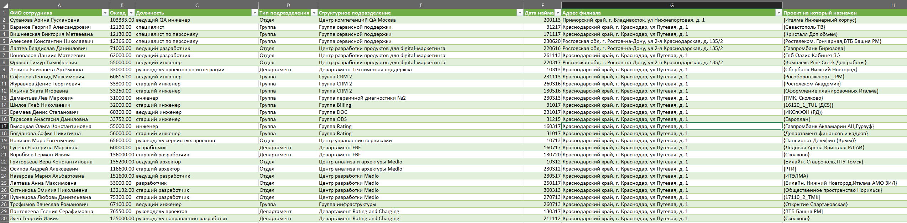

Легенда
Заказчик передал вам файл в формате Excel, в котором сформирован отчёт.

На основе этого отчёта нужно выполнить следующие задания.

Задание 1
Опишите не менее семи таблиц, из которых состоит база данных. Определите:

какие данные хранятся в этих таблицах,
какой тип данных у столбцов в этих таблицах, если данные хранятся в PostgreSQL.
Начертите схему полученной модели данных. Можете использовать онлайн-редактор: https://app.diagrams.net/

Этапы реализации:

Внимательно изучите предоставленный вам файл с данными и подумайте, как можно сгруппировать данные по смыслу.
Разбейте исходный файл на несколько таблиц и определите список столбцов в каждой из них.
Для каждого столбца подберите подходящий тип данных из PostgreSQL.
Для каждой таблицы определите первичный ключ (PRIMARY KEY).
Определите типы связей между таблицами.
Начертите схему модели данных. На схеме должны быть чётко отображены:
все таблицы с их названиями,
все столбцы с указанием типов данных,
первичные ключи (они должны быть явно выделены),
линии, показывающие связи между таблицами.
Результатом выполнения задания должен стать скриншот получившейся схемы базы данных.

# Схема базы данных

## Таблицы



### Сотрудники
| Столбец             | Тип данных      | Описание                |
|---------------------|----------------|-------------------------|
| id (PK)             | SERIAL         | Уникальный идентификатор|
| фио                 | VARCHAR(100)   | Полное имя сотрудника   |
| оклад               | DECIMAL(10,2)  | Размер заработной платы |
| дата_приема         | DATE           | Дата трудоустройства    |
| id_должности (FK)   | INTEGER        | Ссылка на должность     |
| id_подразделения (FK)| INTEGER       | Ссылка на подразделение |
| id_филиала (FK)     | INTEGER        | Ссылка на филиал        |
| id_проекта (FK)     | INTEGER        | Ссылка на проект        |

### Должности
| Столбец       | Тип данных      | Описание          |
|---------------|----------------|-------------------|
| id (PK)       | SERIAL         | Идентификатор     |
| наименование  | VARCHAR(50)    | Название должности|

### Подразделения
| Столбец       | Тип данных      | Описание               |
|---------------|----------------|------------------------|
| id (PK)       | SERIAL         | Идентификатор          |
| название      | VARCHAR(100)   | Название подразделения |
| id_типа (FK)  | INTEGER        | Тип подразделения      |

### ТипыПодразделений
| Столбец | Тип данных      | Описание                        |
|---------|----------------|---------------------------------|
| id (PK) | SERIAL         | Идентификатор                   |
| тип     | VARCHAR(50)    | Отдел/Группа/Департамент        |

### Филиалы
| Столбец | Тип данных      | Описание              |
|---------|----------------|-----------------------|
| id (PK) | SERIAL         | Идентификатор         |
| адрес   | VARCHAR(200)   | Полный адрес          |
| регион  | VARCHAR(50)    | Регион расположения   |

### Проекты
| Столбец  | Тип данных      | Описание            |
|----------|----------------|---------------------|
| id (PK)  | SERIAL         | Идентификатор       |
| название | VARCHAR(100)   | Наименование проекта|

## Связи между таблицами

- `Сотрудники.id_должности` → `Должности.id`
- `Сотрудники.id_подразделения` → `Подразделения.id`
- `Сотрудники.id_филиала` → `Филиалы.id`
- `Сотрудники.id_проекта` → `Проекты.id`
- `Подразделения.id_типа` → `ТипыПодразделений.id`

## Диаграмма связей (текстовая)
```
+-------------------+       +-------------------+       +-------------------+
|   Филиалы         |       |   Сотрудники      |       |   Должности       |
+-------------------+       +-------------------+       +-------------------+
| PK id             |<------| PK id             |------>| PK id             |
|    адрес          |       |    фио            |       |    наименование   |
|    регион         |       |    оклад          |       +-------------------+
+-------------------+       |    дата_приема    |             ^
                            | FK id_филиала     |             |
                            | FK id_должности   |-------------+
                            | FK id_подразделения |
                            | FK id_проекта     |
                            +-------------------+
                                      ^
                                      |
                            +-------------------+
                            |   Проекты         |
                            +-------------------+
                            | PK id             |
                            |    название       |
                            +-------------------+
                                      ^
                                      |
+-------------------+       +-------------------+
| ТипыПодразделений |       | Подразделения     |
+-------------------+       +-------------------+
| PK id             |<------| PK id             |
|    тип            |       |    название       |
+-------------------+       | FK id_типа        |
                            +-------------------+
```

```

-- Создание базы данных
CREATE DATABASE company_structure;

-- Подключение к созданной базе данных
\c company_structure

-- Создание таблицы ТипыПодразделений
CREATE TABLE ТипыПодразделений (
    id SERIAL PRIMARY KEY,
    тип VARCHAR(50) NOT NULL
);

-- Создание таблицы Подразделения
CREATE TABLE Подразделения (
    id SERIAL PRIMARY KEY,
    название VARCHAR(100) NOT NULL,
    id_типа INTEGER REFERENCES ТипыПодразделений(id)
);

-- Создание таблицы Должности
CREATE TABLE Должности (
    id SERIAL PRIMARY KEY,
    наименование VARCHAR(50) NOT NULL
);

-- Создание таблицы Филиалы
CREATE TABLE Филиалы (
    id SERIAL PRIMARY KEY,
    адрес VARCHAR(200) NOT NULL,
    регион VARCHAR(50) NOT NULL
);

-- Создание таблицы Проекты
CREATE TABLE Проекты (
    id SERIAL PRIMARY KEY,
    название VARCHAR(100) NOT NULL
);

-- Создание таблицы Сотрудники
CREATE TABLE Сотрудники (
    id SERIAL PRIMARY KEY,
    фио VARCHAR(100) NOT NULL,
    оклад DECIMAL(10,2) NOT NULL,
    дата_приема DATE NOT NULL,
    id_должности INTEGER REFERENCES Должности(id),
    id_подразделения INTEGER REFERENCES Подразделения(id),
    id_филиала INTEGER REFERENCES Филиалы(id),
    id_проекта INTEGER REFERENCES Проекты(id)
);

-- Заполнение справочника ТипыПодразделений
INSERT INTO ТипыПодразделений (тип) VALUES 
('Отдел'),
('Группа'),
('Департамент');

-- Заполнение справочника Должности
INSERT INTO Должности (наименование) VALUES 
('Менеджер'),
('Разработчик'),
('Аналитик'),
('Тестировщик'),
('Дизайнер');

-- Заполнение таблицы Филиалы
INSERT INTO Филиалы (адрес, регион) VALUES 
('г. Москва, ул. Тверская, д.1', 'Центральный'),
('г. Санкт-Петербург, Невский пр-т, д.10', 'Северо-Западный'),
('г. Новосибирск, ул. Ленина, д.5', 'Сибирский');

-- Заполнение таблицы Проекты
INSERT INTO Проекты (название) VALUES 
('Разработка CRM системы'),
('Модернизация сайта'),
('Внедрение ERP системы');

-- Заполнение таблицы Подразделения
INSERT INTO Подразделения (название, id_типа) VALUES 
('Отдел разработки', 1),
('Группа тестирования', 2),
('Департамент аналитики', 3);

-- Заполнение таблицы Сотрудники
INSERT INTO Сотрудники (фио, оклад, дата_приема, id_должности, id_подразделения, id_филиала, id_проекта) VALUES 
('Иванов Иван Иванович', 120000.00, '2020-05-15', 2, 1, 1, 1),
('Петров Петр Петрович', 95000.00, '2021-03-10', 3, 3, 2, 2),
('Сидорова Мария Сергеевна', 110000.00, '2019-11-20', 4, 2, 3, 3);
```